# ERD — Care Pulse Backend (be-care-pulse)

**Sumber:** disusun dari seluruh migrasi aktif di `database/migrations/` (kolom hasil `create` + `alter` sudah digabung).
**Database:** MySQL (Laravel 12). **Tanggal:** 2026-07-01.

## Catatan baca diagram

- **Kolom audit** dimiliki hampir semua tabel domain dan **tidak ditulis ulang** di tiap entitas agar ringkas:
  `created_at`, `created_by`, `updated_at`, `updated_by`, `deleted_at`, `deleted_by` (pola `HasAuditColumns` + soft delete via `deleted_by`).
  Pengecualian append-only (tanpa soft delete): `instrument_stock_logs` & `order_events` (hanya `created_by`/`created_at`).
- Tabel infrastruktur Laravel (`sessions`, `cache`, `cache_locks`, `jobs`, `job_batches`, `failed_jobs`,
  `password_reset_tokens`, `personal_access_tokens`) dikecualikan dari ERD domain.
- Nama tabel `order` adalah reserved keyword SQL (di-quote Laravel; model `Order` pakai `protected $table = 'order'`).
- Notasi kardinalitas Mermaid: `||--o{` = satu-ke-banyak (opsional), `||--||` = satu-ke-satu.

---

## Diagram (Mermaid)

```mermaid
erDiagram
%% ========== AUTH & RBAC ==========
authorities ||--o{ users : "punya"
authorities ||--o{ authority_menu : ""
menus ||--o{ authority_menu : ""
title_menuses ||--o{ menus : "berisi"
menus ||--o{ menus : "parent-child"

%% ========== MASTER DATA ==========
instruments ||--o{ instrument_stocks : "unit fisik"
conditions ||--o{ instrument_stocks : "kondisi"
instrument_stocks ||--o{ instrument_stock_logs : "riwayat"
instrument_catalogs ||--o{ instrument_catalog_items : "komponen"
instruments ||--o{ instrument_catalog_items : ""
conditions ||--o{ instrument_catalog_items : "std kondisi"

%% ========== CSSD — ORDER & PIPELINE ==========
rooms ||--o{ order : "peminjam"
users ||--o{ order : "pembuat"
order ||--o{ order_item : "unit dipinjam"
instrument_stocks ||--o{ order_item : ""
conditions ||--o{ order_item : "kondisi in/out"
order ||--o{ order_request_item : "baris permintaan"
instruments ||--o{ order_request_item : ""
instrument_catalogs ||--o{ order_request_item : ""
order ||--o{ order_events : "timeline"
rooms ||--o{ order_events : ""
order ||--|| order_washing : "cleaning"
washer_machines ||--o{ order_washing : "mesin"
order ||--o{ sterilizations : "batch steril"
sterilizations ||--o{ sterilization_items : "unit"
instrument_stocks ||--o{ sterilization_items : ""
order ||--o{ instrument_storages : "penyimpanan"
sterilizations ||--o{ instrument_storages : ""
instrument_stocks ||--o{ instrument_storages : ""

%% ========== CSSD — HANDOVER (PINJAM-ALIH) ==========
order ||--o{ order_transfers : "asal (from)"
order ||--o{ order_transfers : "hasil (new)"
users ||--o{ order_transfers : "holder/requester"
rooms ||--o{ order_transfers : "tujuan"
order_transfers ||--o{ order_transfer_items : "unit"
instrument_stocks ||--o{ order_transfer_items : ""

%% ========== CSSD — DISTRIBUSI BMHP ==========
rooms ||--o{ distributions : "tujuan"
users ||--o{ distributions : "sender/receiver"
distributions ||--o{ distribution_items : "isi"
bmhps ||--o{ distribution_items : ""

%% ========== CLINICAL PATHWAY ==========
icd10 ||--o{ template_clinical_pathway : "diagnosa"
template_clinical_pathway ||--o{ point_clinical_pathway : "poin"
categori_clinical_pathway ||--o{ point_clinical_pathway : "kategori"
point_clinical_pathway ||--o{ point_clinical_pathway : "sub-poin"
template_clinical_pathway ||--o{ asesmen_clinical_pathway : "formulir"
rooms ||--o{ asesmen_clinical_pathway : "ruang rawat"
asesmen_clinical_pathway ||--o{ asesmen_point_clinical_pathway : "ceklis"
point_clinical_pathway ||--o{ asesmen_point_clinical_pathway : ""
asesmen_clinical_pathway ||--o{ varian_clinical_pathway : "varian"

%% ================= ENTITAS =================
users {
    bigint id PK
    string name
    string username UK
    string no_telephone
    bigint authority_id FK
    string email UK
    string password
}
authorities {
    bigint id PK
    string name UK
    string description
}
title_menuses {
    bigint id PK
    string title
    int sort_order
}
menus {
    bigint id PK
    bigint title_menu_id FK
    bigint parent_id FK
    string name
    string url
    string icon
    int sort_order
    bool is_open
}
authority_menu {
    bigint id PK
    bigint authority_id FK
    bigint menu_id FK
}

conditions {
    bigint id PK
    string name UK
}
instruments {
    bigint id PK
    string code UK
    string name
    string image
}
instrument_stocks {
    bigint id PK
    bigint instrument_id FK
    string code UK
    bigint condition_id FK
    string status "tersedia|dipinjam|sterilisasi|dikembalikan"
}
instrument_stock_logs {
    bigint id PK
    bigint instrument_stock_id FK
    string from_status
    string to_status
    string context "create|manual|order|sterilization|set"
    string reference_code
    text note
    string created_by
}
rooms {
    bigint id PK
    string code UK
    string name UK
}
instrument_catalogs {
    bigint id PK
    string code UK
    string name
    string image
    enum type "single|paket"
    text description
}
instrument_catalog_items {
    bigint id PK
    bigint instrument_catalog_id FK
    bigint instrument_id FK
    int quantity
    bigint standard_condition_id FK
    string note
}
bmhps {
    bigint id PK
    string code UK
    string name
    string unit
    int stock_qty
    text description
}
icd10 {
    bigint id PK
    string code
    string display
    string version
}
washer_machines {
    bigint id PK
    string code UK
    string name
    string location
    decimal min_temperature
    decimal max_temperature
    int min_duration_minutes
    int max_duration_minutes
    string status "aktif|nonaktif"
    text note
}

order {
    bigint id PK
    string code UK
    string code_transaction "index; bisa dibagi antar rantai handover"
    bigint room_id FK "nullable (produksi CSSD)"
    bigint user_id FK
    string borrowed_by
    date order_date
    date return_plan_date
    date return_actual_date
    string returned_by
    string medical_record_no
    string patient_name
    string distributed_to
    timestamp distributed_at
    string status "diajukan|dipinjam|dikembalikan|dibatalkan|..."
    timestamp canceled_at
    string canceled_by
    timestamp processed_at
    string processed_by
    text note
}
order_item {
    bigint id PK
    bigint order_id FK
    bigint instrument_stock_id FK
    string source "satuan|paket"
    string package_name
    bigint condition_out_id FK
    bigint condition_in_id FK
    bool is_returned
}
order_request_item {
    bigint id PK
    bigint order_id FK
    string type "satuan|paket"
    bigint instrument_id FK
    bigint instrument_catalog_id FK
    string package_name
    int quantity
}
order_transfers {
    bigint id PK
    bigint from_order_id FK
    bigint holder_user_id FK
    bigint requested_by_user_id FK
    bigint to_room_id FK
    string borrowed_by
    text note
    string status "pending|accepted|rejected|canceled"
    timestamp responded_at
    bigint new_order_id FK
}
order_transfer_items {
    bigint id PK
    bigint order_transfer_id FK
    bigint instrument_stock_id FK
    string source
    string package_name
}
order_events {
    bigint id PK
    bigint order_id FK
    string code_transaction "index"
    string type "dibuat|diterima|dipinjam|dikembalikan|dipindah"
    bigint room_id FK
    string actor
    string borrowed_by
    string note
    timestamp created_at
}
order_washing {
    bigint id PK
    bigint order_id FK "UK (1:1)"
    bigint washer_machine_id FK
    string machine_no
    string operator
    string temperature
    timestamp washed_at
    int duration_minutes
    string detergent_type
    bool alert
    string alert_message
    string failure_reason
    string status "dalam_proses|selesai"
    timestamp completed_at
}
sterilizations {
    bigint id PK
    bigint order_id FK "nullable"
    string code UK
    string machine
    string method "uap|eo|plasma|panas_kering"
    string cycle_number
    decimal temperature
    int duration_minutes
    string operator
    datetime sterilized_at
    date expiry_date
    string chemical_indicator
    string biological_indicator
    string status "diproses|selesai|gagal"
    text note
}
sterilization_items {
    bigint id PK
    bigint sterilization_id FK
    bigint instrument_stock_id FK
    string result
}
instrument_storages {
    bigint id PK
    bigint order_id FK
    bigint sterilization_id FK
    bigint instrument_stock_id FK
    string rack_code
    date expiry_date
    string status "tersimpan|keluar"
    timestamp stored_at
    timestamp removed_at
}
distributions {
    bigint id PK
    string code UK
    bigint room_id FK
    bigint sender_id FK
    bigint receiver_id FK
    datetime distributed_at
    string status "terdistribusi|dibatalkan"
    text note
}
distribution_items {
    bigint id PK
    bigint distribution_id FK
    bigint bmhp_id FK
    int quantity
    string note
}

categori_clinical_pathway {
    bigint id PK
    int urutan UK
    string label
}
template_clinical_pathway {
    bigint id PK
    bigint icd10_id FK
    int maksimal_hari
    text keterangan
    bool is_active
}
point_clinical_pathway {
    bigint id PK
    bigint template_id FK
    bigint categori_id FK
    bigint parent_id FK
    string label
    string pengisi "dokter|perawat|farmasi|penunjang"
    json hari_wajib
    int urutan
}
asesmen_clinical_pathway {
    bigint id PK
    bigint template_id FK
    string no_rm
    string nama_pasien
    string jenis_kelamin "L|P"
    date tanggal_lahir
    string diagnosa_masuk
    string penyakit_utama
    string penyakit_penyerta
    string komplikasi
    string tindakan
    decimal bb
    decimal tb
    datetime tanggal_jam_masuk
    datetime tanggal_jam_keluar
    int lama_rawat
    string rencana_rawat
    bigint ruang_id FK
    string kelas
    bool rujukan
    string verifikasi_dokter_by
    timestamp verifikasi_dokter_at
    string verifikasi_perawat_by
    timestamp verifikasi_perawat_at
    string verifikasi_pelaksana_by
    timestamp verifikasi_pelaksana_at
}
asesmen_point_clinical_pathway {
    bigint id PK
    bigint asesmen_id FK
    bigint point_id FK
    json checked_hari
    text keterangan
}
varian_clinical_pathway {
    bigint id PK
    bigint asesmen_id FK
    datetime tanggal_waktu
    text varian
    text alasan
    string paraf
}
```



---

## Ringkasan relasi & aturan hapus (onDelete)

### Auth & RBAC

| Parent        | Child          | FK            | onDelete |
| ------------- | -------------- | ------------- | -------- |
| authorities   | users          | authority_id  | null     |
| authorities   | authority_menu | authority_id  | cascade  |
| menus         | authority_menu | menu_id       | cascade  |
| title_menuses | menus          | title_menu_id | null     |
| menus         | menus (self)   | parent_id     | null     |

### Master

| Parent              | Child                    | FK                    | onDelete |
| ------------------- | ------------------------ | --------------------- | -------- |
| instruments         | instrument_stocks        | instrument_id         | cascade  |
| conditions          | instrument_stocks        | condition_id          | set null |
| instrument_stocks   | instrument_stock_logs    | instrument_stock_id   | cascade  |
| instrument_catalogs | instrument_catalog_items | instrument_catalog_id | cascade  |
| instruments         | instrument_catalog_items | instrument_id         | cascade  |
| conditions          | instrument_catalog_items | standard_condition_id | set null |

### CSSD — Order & Pipeline

| Parent                 | Child               | FK                                 | onDelete                                                    |
| ---------------------- | ------------------- | ---------------------------------- | ----------------------------------------------------------- |
| rooms                  | order               | room_id                            | restrict (kolom nullable)                                   |
| users                  | order               | user_id                            | null                                                        |
| order                  | order_item          | order_id                           | cascade                                                     |
| instrument_stocks      | order_item          | instrument_stock_id                | restrict                                                    |
| conditions             | order_item          | condition_out_id / condition_in_id | null                                                        |
| order                  | order_request_item  | order_id                           | cascade                                                     |
| instruments            | order_request_item  | instrument_id                      | null                                                        |
| instrument_catalogs    | order_request_item  | instrument_catalog_id              | null                                                        |
| order                  | order_washing       | order_id (**unique → 1:1**)        | cascade                                                     |
| washer_machines        | order_washing       | washer_machine_id                  | null                                                        |
| order                  | sterilizations      | order_id (nullable)                | null                                                        |
| sterilizations         | sterilization_items | sterilization_id                   | cascade                                                     |
| instrument_stocks      | sterilization_items | instrument_stock_id                | restrict, **unique(sterilization_id, instrument_stock_id)** |
| order / sterilizations | instrument_storages | order_id / sterilization_id        | null                                                        |
| instrument_stocks      | instrument_storages | instrument_stock_id                | restrict                                                    |
| order                  | order_events        | order_id                           | cascade (append-only)                                       |
| rooms                  | order_events        | room_id                            | null                                                        |

### CSSD — Handover (Pinjam-alih)

| Parent            | Child                | FK                                    | onDelete |
| ----------------- | -------------------- | ------------------------------------- | -------- |
| order             | order_transfers      | from_order_id                         | cascade  |
| order             | order_transfers      | new_order_id                          | null     |
| users             | order_transfers      | holder_user_id / requested_by_user_id | cascade  |
| rooms             | order_transfers      | to_room_id                            | cascade  |
| order_transfers   | order_transfer_items | order_transfer_id                     | cascade  |
| instrument_stocks | order_transfer_items | instrument_stock_id                   | cascade  |

### CSSD — Distribusi BMHP

| Parent        | Child              | FK                      | onDelete        |
| ------------- | ------------------ | ----------------------- | --------------- |
| rooms         | distributions      | room_id                 | restrict        |
| users         | distributions      | sender_id / receiver_id | null / restrict |
| distributions | distribution_items | distribution_id         | cascade         |
| bmhps         | distribution_items | bmhp_id                 | null            |

### Clinical Pathway

| Parent                    | Child                          | FK          | onDelete                                  |
| ------------------------- | ------------------------------ | ----------- | ----------------------------------------- |
| icd10                     | template_clinical_pathway      | icd10_id    | cascade                                   |
| template_clinical_pathway | point_clinical_pathway         | template_id | cascade                                   |
| categori_clinical_pathway | point_clinical_pathway         | categori_id | cascade                                   |
| point_clinical_pathway    | point_clinical_pathway (self)  | parent_id   | (di-handle aplikasi)                      |
| template_clinical_pathway | asesmen_clinical_pathway       | template_id | cascade                                   |
| rooms                     | asesmen_clinical_pathway       | ruang_id    | null                                      |
| asesmen_clinical_pathway  | asesmen_point_clinical_pathway | asesmen_id  | cascade, **unique(asesmen_id, point_id)** |
| point_clinical_pathway    | asesmen_point_clinical_pathway | point_id    | cascade                                   |
| asesmen_clinical_pathway  | varian_clinical_pathway        | asesmen_id  | cascade                                   |

---

## Cara melihat diagram

- **VS Code:** pasang ekstensi _Markdown Preview Mermaid Support_, lalu buka preview file ini.
- **GitHub:** blok ```mermaid dirender otomatis.
- **Online:** salin blok mermaid ke <https://mermaid.live>.
